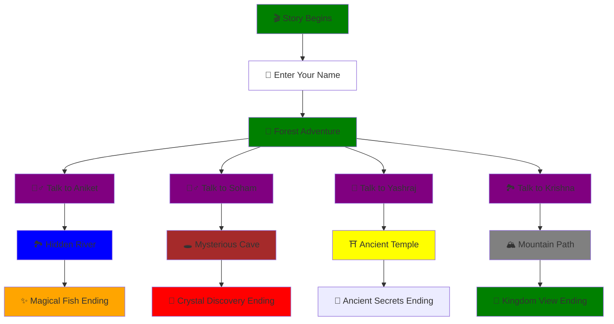

# 📚 Interactive Story-Telling App 📚
### *Where Every Choice Writes Your Destiny*

<div align="center">


</div>

---

<div align="center">

### 📢 *Interactive Experience* | 📽️ *Spotlight Project* | 🎯 *MERN Stack Powered*

</div>

<table align="center">
<tr>
<td align="center"></td>
</td>
</tr>
</table>

---

## 🎯 What Makes This Special?

<div align="center">

```ascii
    ╔═══════════════════════════════════════════════╗
    ║  🌙 DARK/LIGHT MODE  │   🎭 MULTIPLE ENDINGS  ║
    ║  📱 RESPONSIVE UI    │   ⚡ REAL-TIME UPDATES ║
    ║  🚀 MERN STACK       │   🎨 BEAUTIFUL DESIGN  ║
    ╚═══════════════════════════════════════════════╝
```

</div>

> **Transform static storytelling into an interactive journey where YOU control the narrative!**
> Experience branching storylines, dynamic character interactions, and endings that change based on your choices.

---

## 🛠️ Power Stack

<div align="center">

<table>
<tr>
<td align="center" width="25%">
<br>
<sub><b>MongoDB</b></sub><br>
<sub>Story Database</sub>
</td>
<td align="center" width="25%">
<br>
<sub><b>Express.js</b></sub><br>
<sub>API Backend</sub>
</td>
<td align="center" width="25%">
<br>
<sub><b>React</b></sub><br>
<sub>Interactive UI</sub>
</td>
<td align="center" width="25%">
<br>
<sub><b>Node.js</b></sub><br>
<sub>Server Runtime</sub>
</td>
</tr>
</table>

</div>

---

## 🎮 App Flow Architecture



---

## 🚀 Lightning Fast Setup

<div align="center">

### ⚡ Get Running !

</div>

<details>
<summary><b>📋 Prerequisites Checklist</b></summary>

- ✅ Node.js (v14+)
- ✅ MongoDB (local or Atlas)
- ✅ npm
- ✅ Git

</details>

### 🎯 Installation Commands

<table>
<tr>
<td width="50%">

**🔧 Backend Setup**
```bash
# 📥 Clone Repository
git clone https://github.com/soham-kyo/Interactive-Story-Telling-App.git
cd Interactive-Story-Telling-App

# 🔙 Backend Configuration  
cd backend
npm install

# 🔐 Environment Setup
echo "MONGO_URI=your_connection_string" > .env

# 🚀 Launch Backend
npm start (or) node server.js
```

</td>
<td width="50%">

**🎨 Frontend Setup**
```bash
# 🎨 Frontend Configuration
cd ../frontend
npm install

# 🌐 Start Development Server
npm start

# 🎉 Open Browser
# http://localhost:3000
```

</td>
</tr>
</table>

---

## 📊 Project Architecture

```

interactive-story-telling-app/
├── 📁 frontend/
│   ├── 📁 public/
│   │   ├── 🖼️ photos
│   │   ├── 📑 manifest.json
    │   └── 📄 index.html
│   ├── 📁 src/
│   │   ├── 📁 components/
│   │   │   └── 📄 StoryScreen.js
│   │   ├── 📄 App.js
│   │   ├── 🎨 App.css
│   │   ├── 🎨 index.css
│   │   ├── 📄 index.js
│   │   ├── 📄 reportWebVitals.js
│   │   ├── 📄 setupTests.js
│   │   └── 📑 App.test.js
│   ├── 📦 package-lock.json
│   └── 📦 package.json
├── 📁 backend/
│   ├── 📁 models/
│   │   └── 📄 Story.js
│   ├── 📁 routes/
│   │   └── 📄 storyRoutes.js
│   ├── 🔐 .env
│   ├── 📄 forestStoryData.js
│   ├── 🌱 seed.js
│   ├── 🚀 server.js 
│   ├── 🔒 .env.sample
│   ├── 📦 package.json
│   └── 🔒 package-lock.json
├── 🚫 .gitignore
├── 📜 LICENSE (MIT)
└── 📝 README.md

```
---

## 🎭 Story Features Showcase

<div align="center">

<table>
<tr>
<th>🌟 Feature</th>
<th>📝 Description</th>
<th>🎯 Impact</th>
</tr>
<tr>
<td><b>🌙 Theme Toggle</b></td>
<td>Seamless dark/light mode switching</td>
<td>Enhanced user experience</td>
</tr>
<tr>
<td><b>🎭 Branching Stories</b></td>
<td>Multiple story paths and endings</td>
<td>High replay value</td>
</tr>
<tr>
<td><b>📱 Responsive Design</b></td>
<td>Perfect on all device sizes</td>
<td>Universal accessibility</td>
</tr>
<tr>
<td><b>⚡ Real-time Updates</b></td>
<td>Instant story progression</td>
<td>Smooth user flow</td>
</tr>
<tr>
<td><b>🎨 Visual Storytelling</b></td>
<td>Rich images for each scene</td>
<td>Immersive experience</td>
</tr>
</table>

</div>

---

## 🚀 API Reference

<div align="center">

| 🛣️ Endpoint | 🔧 Method | 📋 Description | 🎯 Response |
|------------|----------|---------------|------------|
| `/api/stories` | `GET` | Fetch all stories | `📚 Story Array` |
| `/api/stories/:id` | `GET` | Get specific story | `📖 Single Story` |
| `/api/stories` | `POST` | Create new story | `✅ Created Story` |

</div>

---

## 🏆 Achievements

<div align="center">


</div>

---

## 📞 Connect & Support

<div align="center">
    
[](https://linkedin.com/in/sohamkyo)
[](mailto:sohamkyo@gmail.com)

</div>

---

## 📜 License

<div align="center">

This project is licensed under the **MIT License** 📋  
*Feel free to use, modify, and distribute!*

[](https://opensource.org/licenses/MIT)

</div>

---

<div align="center">

### ⭐ Found this project helpful? Give it a star!


**🚀 Built by [Soham Patil](https://github.com/soham-kyo)**

</div>

---

<div align="center">
    
[](https://star-history.com/#soham-kyo/Interactive-Story-Telling-App&Date)

</div>

---
